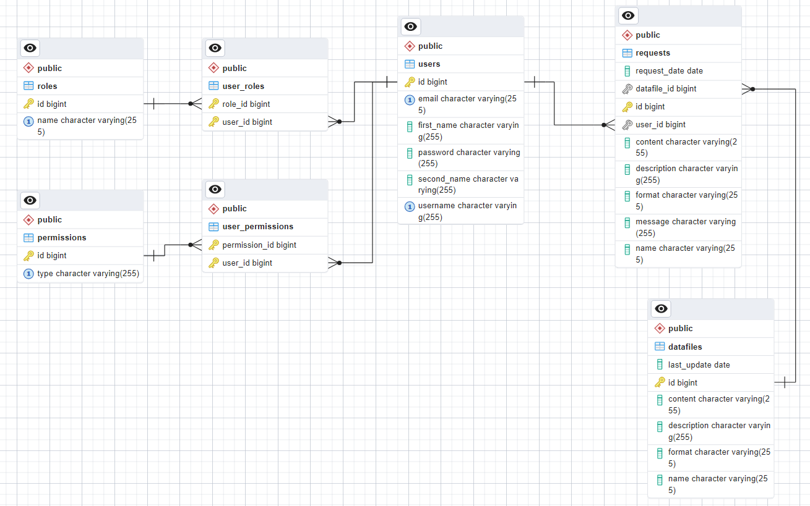

# Проєктування бази даних

## Модель бізнес-об'єктів

@startuml

entity User <<ENTITY>> #CCFFFF
entity User.id <<NUMBER>> #FFFFFF
entity User.username <<TEXT>> #FFFFFF
entity User.password <<TEXT>> #FFFFFF
entity User.email <<TEXT>> #FFFFFF
entity User.firstName <<TEXT>> #FFFFFF
entity User.secondName <<TEXT>> #FFFFFF

entity UserRole <<ENTITY>> #CCFFFF

entity Role <<ENTITY>> #CCFFFF
entity Role.id <<NUMBER>> #FFFFFF
entity Role.name <<TEXT>> #FFFFFF

entity UserPermission <<ENTITY>> #CCFFFF

entity Permission <<ENTITY>> #CCFFFF
entity Permission.id <<NUMBER>> #FFFFFF
entity Permission.type <<TEXT>> #FFFFFF

entity Request <<ENTITY>> #CCFFFF
entity Request.id <<NUMBER>> #FFFFFF
entity Request.message <<TEXT>> #FFFFFF
entity Request.requestDate <<DATETIME>> #FFFFFF
entity Request.name <<TEXT>> #FFFFFF
entity Request.content <<TEXT>> #FFFFFF
entity Request.description <<TEXT>> #FFFFFF
entity Request.format <<TEXT>> #FFFFFF

entity Datafile <<ENTITY>> #CCFFFF
entity Datafile.id <<NUMBER>> #FFFFFF
entity Datafile.name <<TEXT>> #FFFFFF
entity Datafile.content <<TEXT>> #FFFFFF
entity Datafile.description <<TEXT>> #FFFFFF
entity Datafile.format <<TEXT>> #FFFFFF
entity Datafile.lastUpdate <<DATETIME>> #FFFFFF

User *-u- User.id
User *-u- User.username
User *-u- User.password
User *-u- User.email
User *-u- User.firstName
User *-u- User.secondName

Role *-u- Role.id
Role *-u- Role.name

Permission *-u- Permission.id
Permission *-u- Permission.type

Request *-u- Request.id
Request *-u- Request.message
Request *-u- Request.requestDate
Request *-u- Request.name
Request *-u- Request.content
Request *-u- Request.description
Request *-u- Request.format

Datafile *-u- Datafile.id
Datafile *-u- Datafile.name
Datafile *-u- Datafile.content
Datafile *-u- Datafile.description
Datafile *-u- Datafile.format
Datafile *-u- Datafile.lastUpdate

User "1,1" -u- "0,*" UserRole

UserRole "0,*" -r- "1,1" Role

UserPermission "0,*" -r- "1,1" Permission

User "1,1" -u- "0,*" UserPermission

User "1,1" -u- "0,*" Request

Request "0,*" -r- "1,1" Datafile

left to right direction

@enduml

## ER-модель

@startuml  
entity User <<ENTITY>>{
User.id:NUMBER
User.username:TEXT
User.password:TEXT
User.email:TEXT
User.firstName:TEXT
User.secondName:TEXT
}

entity UserRole <<ENTITY>>{
}

entity Role <<ENTITY>>{ 
Role.name:TEXT 
Role.id:NUMBER 
}

entity UserPermission <<ENTITY>>{
}

entity Permission <<ENTITY>>{
Permission.type:TEXT
Permission.id:NUMBER
}

entity Request <<ENTITY>> {
Request.id:NUMBER
Request.message:TEXT
Request.requestDate:DATETIME
Request.name:TEXT
Request.content:TEXT
Request.description:TEXT
Request.format:TEXT
}

entity Datafile <<ENTITY>> { 
Datafile.id:NUMBER 
Datafile.name:TEXT 
Datafile.content:TEXT 
Datafile.description:TEXT 
Datafile.format:TEXT 
Datafile.lastUpdate:DATETIME    
}

User "1,1" -- "0,*" UserRole
UserRole "0,*" -r- "1,1" Role

User "1,1" -- "0,*" UserPermission
UserPermission "0,*" -r- "1,1" Permission

User "1,1" -- "0,*" Request
Request "0,*" -r- "1,1" Datafile

@enduml

## Реляційна схема

